# WhatsApp Automation com n8n e WAHA

Este projeto configura um ambiente de automação do WhatsApp usando n8n (plataforma de automação de fluxo de trabalho) e WAHA (WhatsApp HTTP API).

## Requisitos

- Docker
- Docker Compose
- Windows 10 ou superior

## Serviços

### n8n
- **Porta**: 5678
- **URL**: http://localhost:5678
- **Descrição**: Plataforma de automação de fluxo de trabalho que permite criar automações complexas
- **Volumes**: 
  - `n8n_data`: Armazena dados persistentes do n8n

### WAHA (WhatsApp HTTP API)
- **Porta**: 3000
- **URL**: http://localhost:3000
- **Descrição**: API HTTP para automação do WhatsApp
- **Volumes**:
  - `waha_data`: Armazena dados persistentes do WAHA
- **Variáveis de Ambiente**:
  - `WHATSAPP_GROUP_LIMIT`: Limite de membros em grupos (256)
  - `WHATSAPP_WEBHOOK_URL`: URL do webhook para integração com n8n
  - `WHATSAPP_DEFAULT_ENGINE`: Engine padrão (noweb)
  - `WHATSAPP_HOOK_EVENTS`: Eventos monitorados (message)

## Como Executar

### 1. Clone e Inicialização
```bash
git clone https://github.com/linusmasters/whatsapp-n8n.git
cd whatsapp_automation
docker-compose up -d
```

### 2. Configuração do n8n
1. Acesse http://localhost:5678
2. Realize seu cadastro inicial
3. Crie um novo fluxo de trabalho
4. Configure o n8n para usar o WAHA:
   - No seu nome de usuário (canto inferior esquerdo) clique em settings
   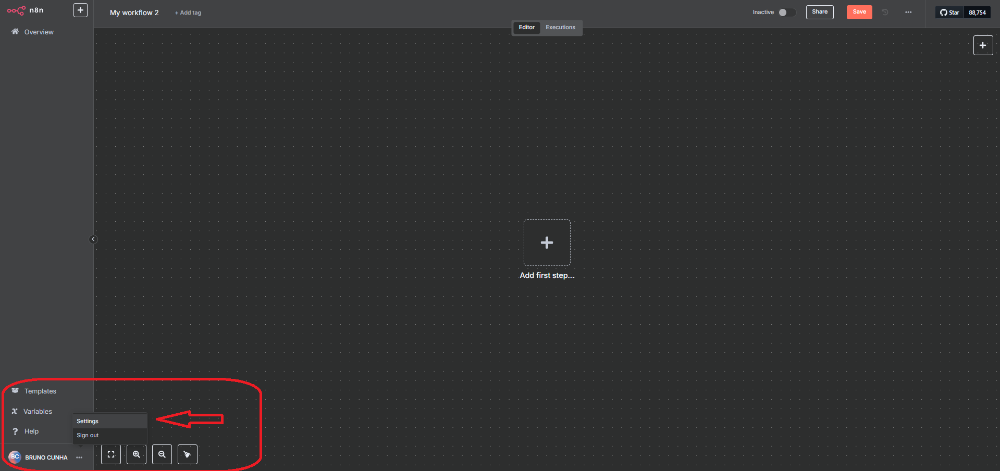
   
   - Entre em Community Nodes e clique em install
   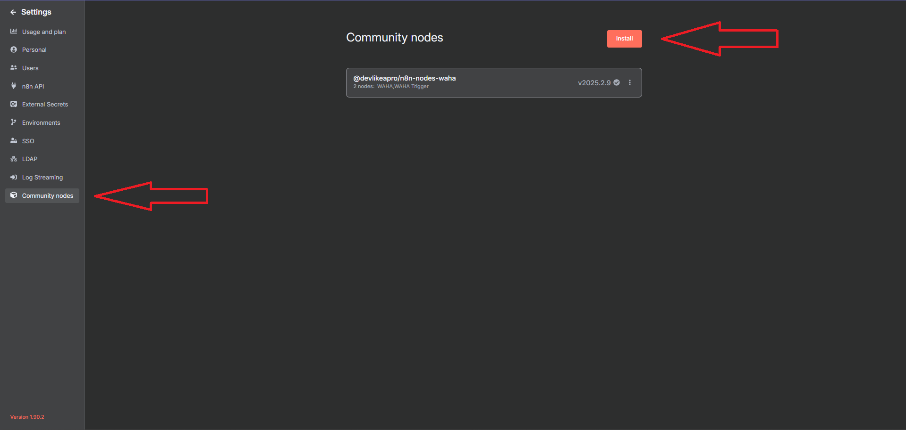
   
   - Adicione o pacote npm @devlikeapro/n8n-nodes-waha
   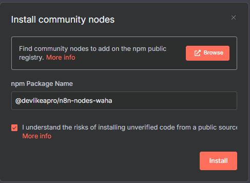
   
   - Adicione como primeiro node o Waha trigger
   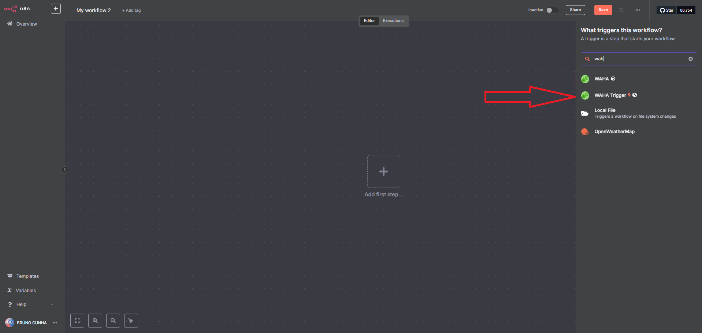
   
   - Copie a url de teste do node
   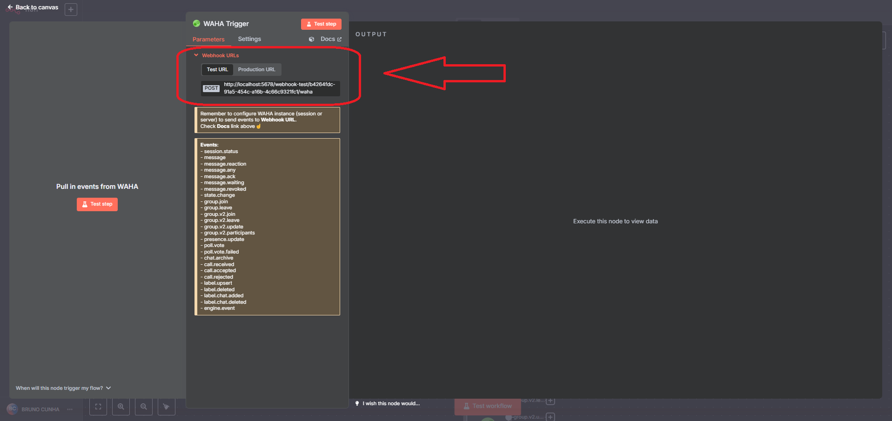

### 3. Configuração do WAHA
1. Acesse http://localhost:3000/dashboard
2. Conecte seu WhatsApp:
   - Clique em "Scan QR Code" e Escaneie o QR Code com seu WhatsApp
   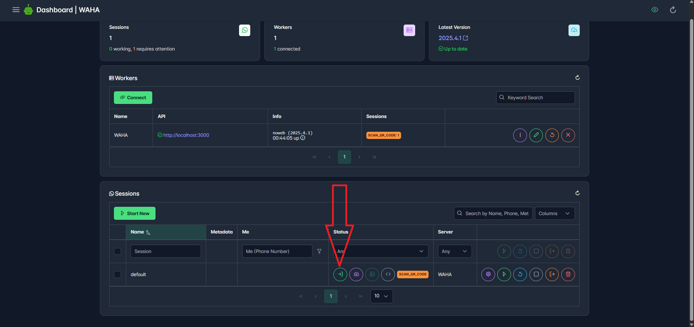
   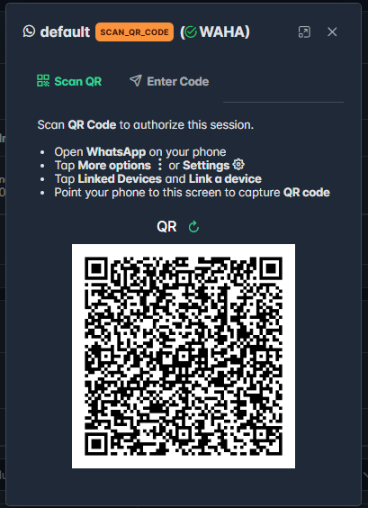
   - Aguarde a conexão ser estabelecida

3. Configure o Webhook para enviar teste ao n8n:
   - Configure a url de teste do webhook copiada na etapa anterior do n8n
   - Substitua o localhost por host.docker.internal
   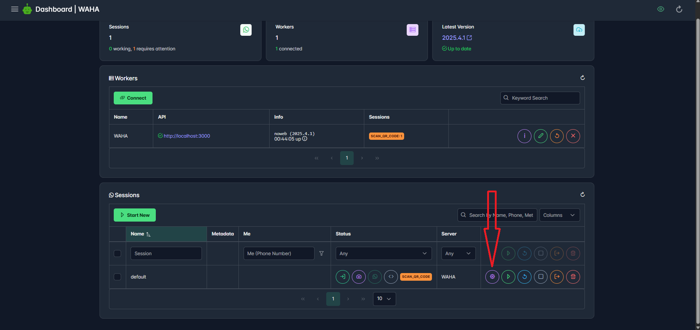
   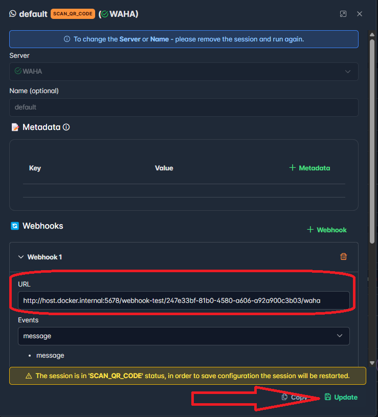

### 4. Configuração do n8n
1. No n8n:
   - Selecione o Waha trigger criado anteriormente, e clique em "Test Step"
   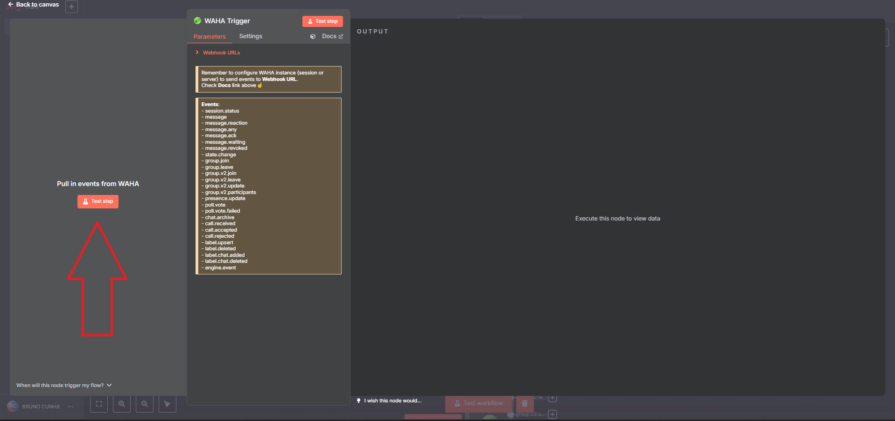
   - Mande uma mensagem para você mesmo, para ativar o webhook
   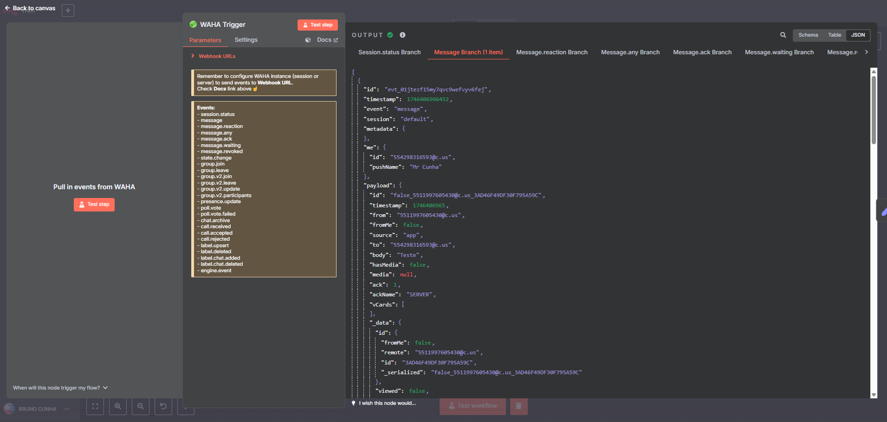
   - Adicione um node de Edit fields, para mapear apenas os campos necessários (session, from, body, id) e clique em "Test Step"
   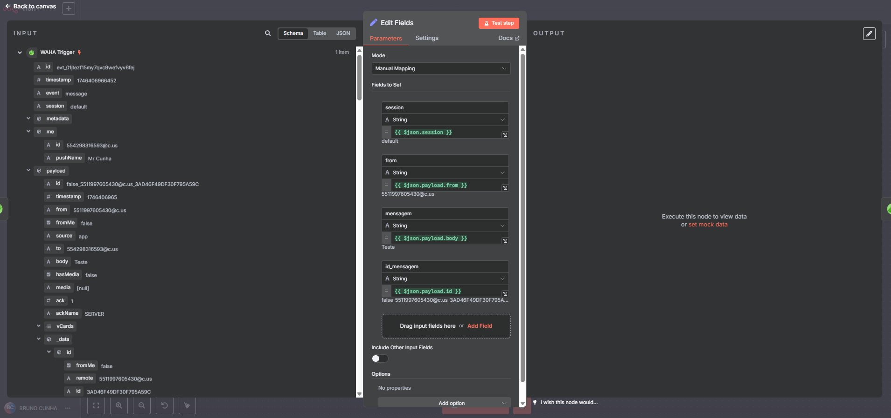
   - Adicione um node do waha (send seen), clique em credentials, e insira o endereço do docker do container do waha, também adicione a session, chat id e message id. Também remova o campo participant e clique em "Test Step"
   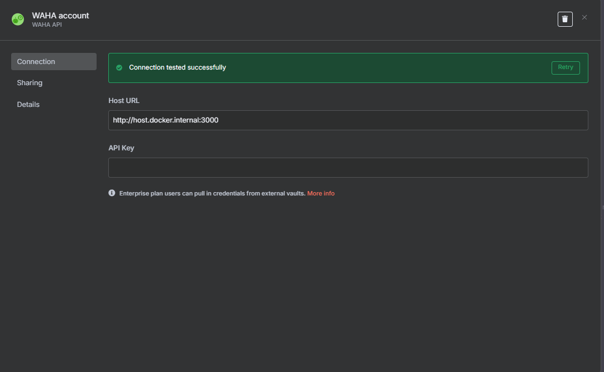
   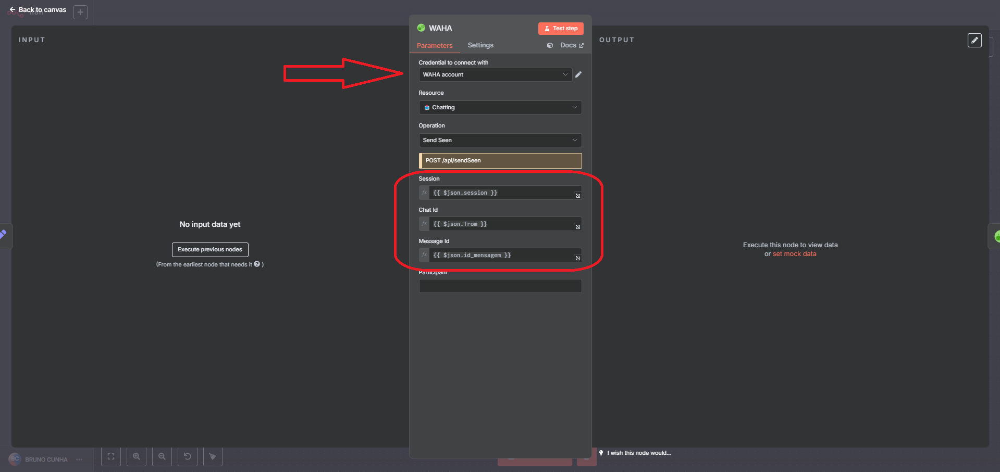
   - Adicione um node do waha (send text), insira a session e chat id, e no campo text coloque a mensagem que deseja enviar e clique em "Test Step"
   
   - O resultado será parecido com este
   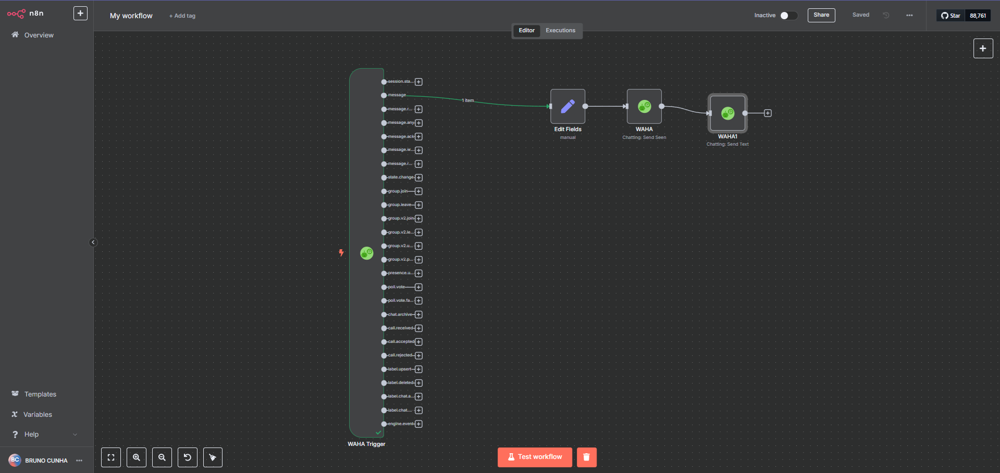
   

## Comandos Úteis

- Iniciar serviços:
```bash
docker-compose up -d
```

- Parar serviços:
```bash
docker-compose down
```

- Ver logs:
```bash
docker-compose logs -f
```

- Ver logs de um serviço específico:
```bash
docker-compose logs -f n8n
docker-compose logs -f waha
```

## Estrutura de Diretórios

```
whatsapp_automation/
├── docker-compose.yml
├── README.md
└── images
   ├──n8n/
   └──waha/
└── volumes/
    ├── n8n_data/
    └── waha_data/
```

## Notas Importantes

1. Os dados são persistidos através dos volumes Docker
2. O WAHA está configurado para enviar eventos para o n8n através do webhook
3. O timezone está configurado para America/Sao_Paulo
4. O engine do WAHA está configurado como "noweb"

## Solução de Problemas

1. Se o WAHA não conectar:
   - Verifique se o QR Code está visível
   - Tente reiniciar o container: `docker-compose restart waha`

2. Se o n8n não receber eventos:
   - Verifique se o webhook está configurado corretamente
   - Confirme se a URL do webhook está correta no WAHA

3. Se os serviços não iniciarem:
   - Verifique os logs: `docker-compose logs`
   - Confirme se as portas 5678 e 3000 estão disponíveis 